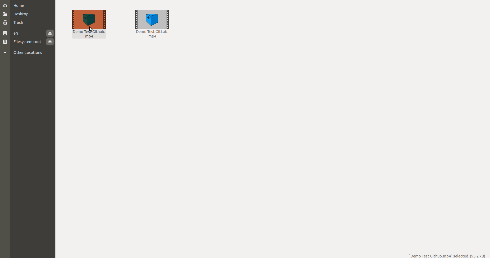

# codeceptjs-selenoid

Selenoid plugin with video recording capabilities for CodeceptJS

## Prerequisite

 - Docker

## How to ?

### 1. Create selenoid container
Run the following command to create one. To know more [refer here](https://aerokube.com/selenoid/latest/#_option_2_start_selenoid_container)
```
docker create                                    \
--name selenoid                                  \
-p 4444:4444                                     \
-v /var/run/docker.sock:/var/run/docker.sock     \
-v `pwd`/:/etc/selenoid/:ro                      \
-v `pwd`/output/video/:/opt/selenoid/video/      \
-e OVERRIDE_VIDEO_OUTPUT_DIR=`pwd`/output/video/ \
aerokube/selenoid:latest-release
```

### 2. Start selenoid container

Run the following command
```
docker start selenoid
```
**Note : If you want to codecept to control this you can skip this step**

### 3. Add plugin configuration in codecept

 Add plugin config to codecept conf. If you don't want the video to be recorded set enableVideo as `false`.
```js
plugins: {
    selenoid: {
      require: '../lib/index',
      enabled: true,
      autoStart: true,
      sessionTimeout: '30m',
      enableVideo: true,
      enableLog: true,
    },
  }
```

## Sample

